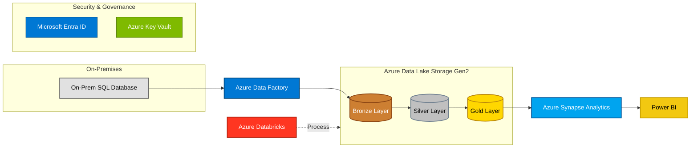

# Azure End-to-End Data Pipeline

Pipeline de données complet sur Azure, de l'ingestion à la visualisation, suivant l'architecture **Medallion** (Bronze → Silver → Gold). Le projet couvre l'orchestration (Azure Data Factory), la transformation (Databricks/PySpark), l'exposition analytique (Synapse Serverless SQL) et le reporting (Power BI), avec une gouvernance des accès basée sur Microsoft Entra ID et Unity Catalog.

## Architecture



## Stack technique

| Couche | Technologie |
|---|---|
| Source | SQL Server (on-premise) |
| Orchestration | Azure Data Factory |
| Stockage | Azure Data Lake Storage Gen2 (ADLS Gen2) |
| Transformation | Azure Databricks (PySpark, Serverless Compute, Unity Catalog) |
| Format de données | Delta Lake |
| Exposition analytique | Azure Synapse Analytics (Serverless SQL Pool) |
| Visualisation | Power BI |
| Sécurité & Gouvernance | Microsoft Entra ID, RBAC, Unity Catalog External Locations |

## Structure du projet

```
azure-end-to-end-data-pipeline/
├── README.md
├── notebooks/
│   ├── bronze_to_silver.py
│   └── silver_to_gold.py
├── adf/
│   └── copy_all_tables_pipeline.json
├── synapse/
│   └── create_gold_views.sql
├── docs/
│   └── architecture.mermaid
└── .gitignore
```

## Pipeline de données

1. **Ingestion (Bronze)** — Azure Data Factory copie les tables depuis SQL Server on-premise vers ADLS Gen2, via un pipeline paramétré (`Lookup` + `ForEach`).
2. **Transformation (Silver)** — Un job Databricks (PySpark) lit les données brutes, normalise les formats de dates et nettoie les données.
3. **Transformation (Gold)** — Un second job Databricks harmonise les noms de colonnes (snake_case) et écrit les données finales en format Delta, compatible avec Synapse Serverless SQL (protocole `minReaderVersion: 1`).
4. **Exposition** — Des vues SQL sont créées dynamiquement sur Synapse Analytics (`OPENROWSET` + `FORMAT DELTA`) pour interroger directement les données Gold.
5. **Visualisation** — Power BI se connecte au endpoint SQL Serverless de Synapse pour construire les tableaux de bord.

## Défis techniques rencontrés et résolus

- **Quotas de calcul Azure** : migration des clusters classiques vers du compute **Serverless** pour s'affranchir des limitations de quota par région.
- **Gouvernance des accès** : mise en place d'External Locations Unity Catalog avec Storage Credentials liés à un Access Connector (Managed Identity), en remplacement des mounts DBFS classiques (incompatibles avec le Serverless).
- **Compatibilité inter-outils** : désactivation des *Deletion Vectors* Delta Lake à l'écriture pour garantir la lecture des tables Gold depuis Synapse Serverless SQL.
- **Orchestration ADF/Databricks** : passage des activités "Notebook" classiques vers des activités "Job" Databricks, seules compatibles avec le compute Serverless dans Azure Data Factory.

## Auteur

**Bilal Khallabi** — Master Big Data & Intelligent Systems
[LinkedIn](https://linkedin.com/in/bilal-khallabi-0a1a8a315) · [GitHub](https://github.com/Bilal51002)
